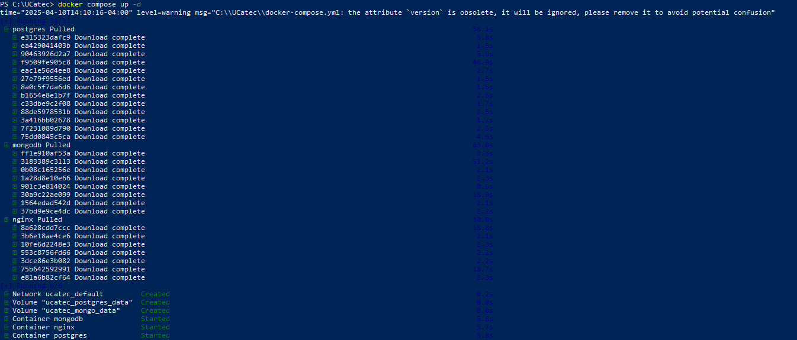
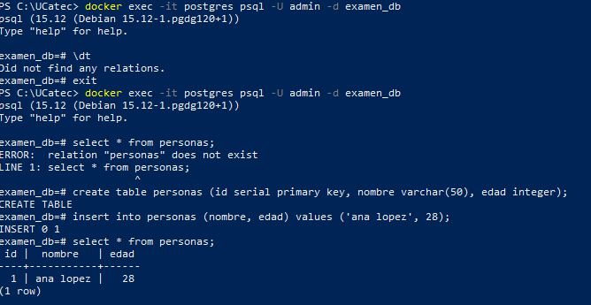
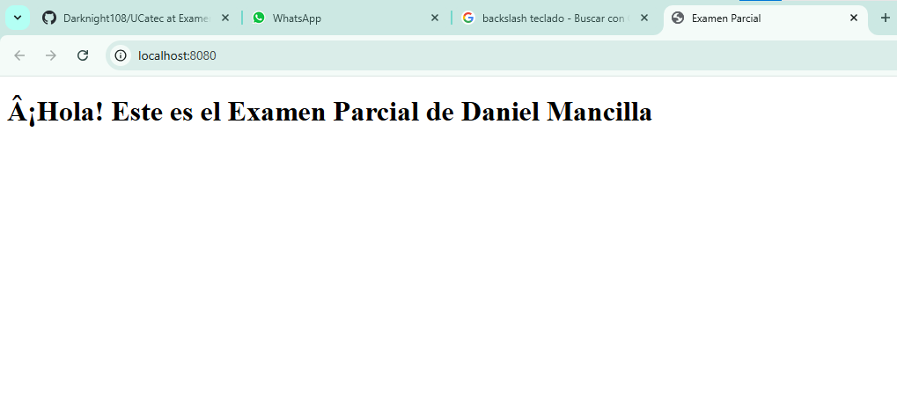

# 📘 Manual: Crear un Entorno con PostgreSQL, MongoDB y Nginx usando Docker Compose

## ✅ Requisitos Previos

Antes de comenzar, asegúrate de tener lo siguiente instalado:

- 🐳 **Docker Desktop**: [Descargar Docker](https://www.docker.com/products/docker-desktop)
- ✍️ **Editor de Código** (recomendado: VSCode): [Descargar VSCode](https://code.visualstudio.com/)


---

## 🧩 Paso 1: Crear archivo `docker-compose.yml`

Este archivo define los servicios de PostgreSQL, MongoDB y Nginx.

```yaml
version: '3.8'

services:
  postgres:
    image: postgres:15
    container_name: postgres
    restart: always
    environment:
      POSTGRES_USER: admin
      POSTGRES_PASSWORD: admin123
      POSTGRES_DB: examen_db
    ports:
      - "5432:5432"
    volumes:
      - postgres_data:/var/lib/postgresql/data

  mongodb:
    image: mongo:6
    container_name: mongodb
    restart: always
    ports:
      - "27017:27017"
    volumes:
      - mongo_data:/data/db

  nginx:
    image: nginx:latest
    container_name: nginx
    restart: always
    ports:
      - "8080:80"
    volumes:
      - ./nginx/default.conf:/etc/nginx/conf.d/default.conf:ro
      - ./html:/usr/share/nginx/html:ro

volumes:
  postgres_data:
  mongo_data:
```

---

## ⚙️ Paso 2: Crear archivos de inicialización

### `nginx/default.conf` – Configuración básica para Nginx

```nginx
server {
    listen 80;

    location / {
        return 200 'Servidor NGINX funcionando 🚀\n';
        add_header Content-Type text/plain;
    }
}
```

---

## 🚀 Paso 3: Levantar los servicios

Abre la terminal en la carpeta del proyecto y ejecuta:

```bash
docker-compose up -d
```



---

## 🧪 Paso 4: Verificar los servicios

### PostgreSQL
ejecuta este comando para ingresar a postgres

```bash
docker exec -it postgres psql -U admin -d examen_db
```
crea una tabla:

```sql
 create table personas (id serial primary key, nombre varchar(50), edad integer);
```
inserta datos:

```sql
insert into personas (nombre, edad) values ('ana lopez', 28);
```

Consulta la tabla:

```sql
SELECT * FROM personas;
```



---

### MongoDB

Conéctate con MongoDB Compass o en terminal:

```bash
docker exec -it mongo-local mongosh
```

Y consulta la colección:

```javascript
use demo_db;
db.usuarios.find();
```
---

### Nginx

Visita en tu navegador:

```
http://localhost:8080
```

Deberías ver:




---

## 🧼 Comandos útiles

- Levantar servicios:

  ```bash
  docker-compose up -d
  ```

- Ver estado:

  ```bash
  docker-compose ps
  ```

- Ver logs:

  ```bash
  docker-compose logs -f
  ```

- Detener y eliminar servicios:

  ```bash
  docker-compose down
  ```

---

## 🧠 Recomendaciones

- Usa volúmenes para persistencia si es un entorno de desarrollo más largo.
- Personaliza las configuraciones según tu proyecto (variables, puertos, etc).
- Puedes agregar otros servicios (Redis, Adminer, etc.) fácilmente al mismo `docker-compose.yml`.

---
